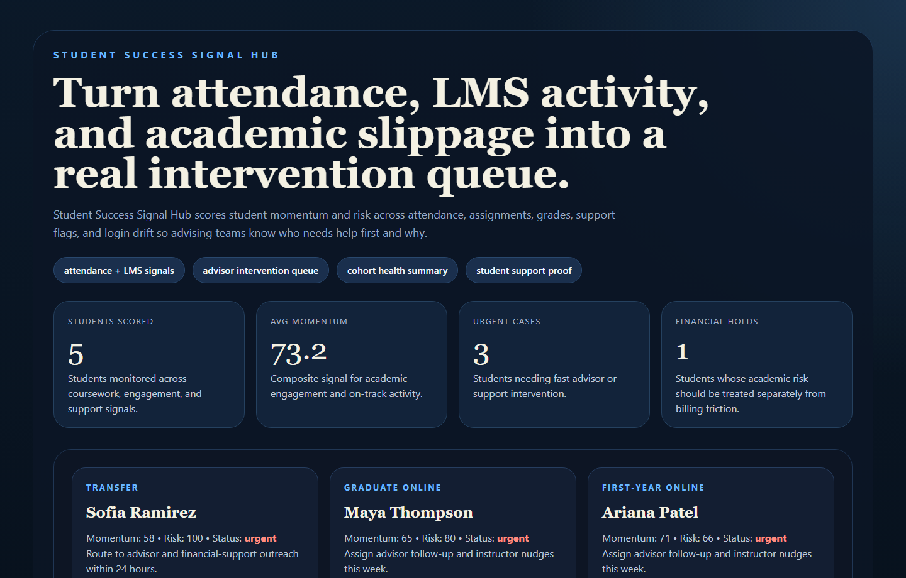
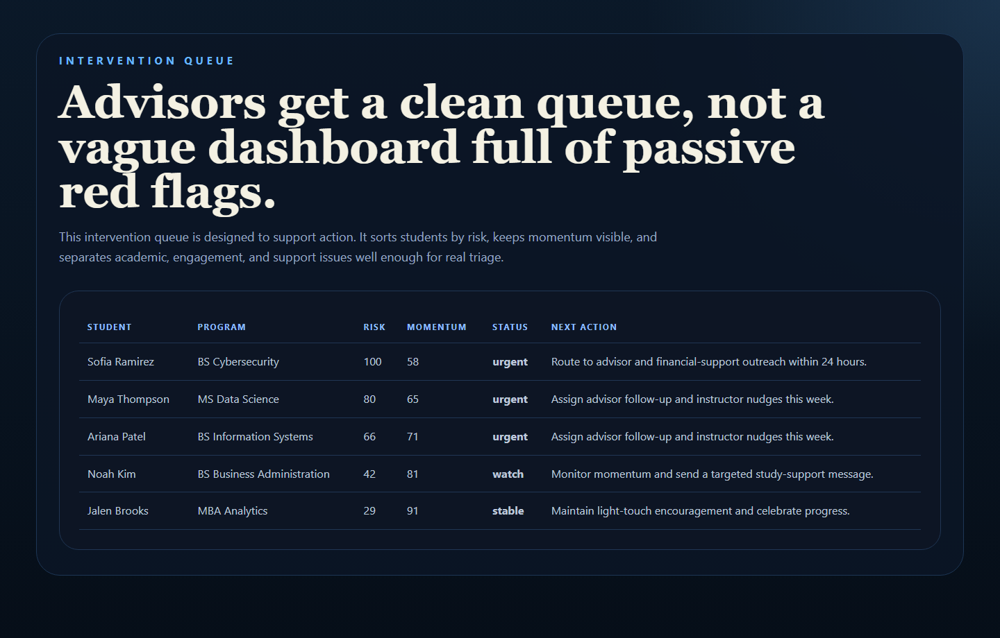
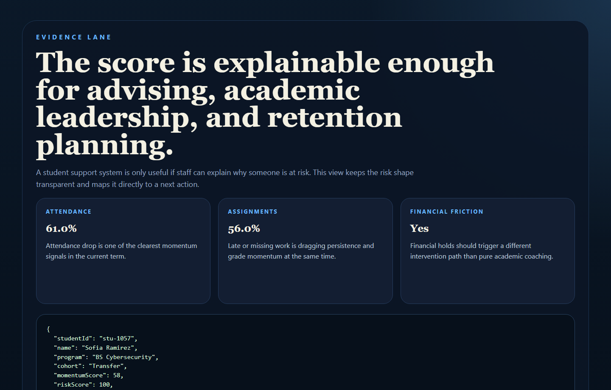
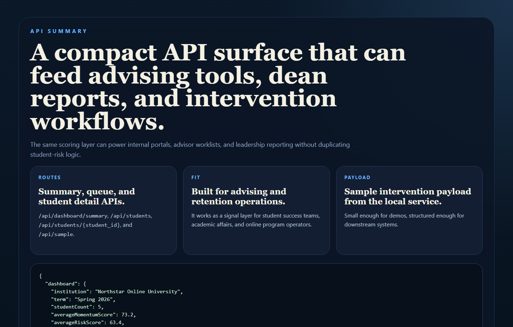

# Student Success Signal Hub

Student success analytics hub for engagement scoring, intervention queues, and
cohort-level support planning.

## Why This Repo Is Good

- It makes the EdTech domain instantly legible: student risk, momentum, and intervention timing.
- It turns common student-success signals into an actual action queue, not just passive reporting.
- It fits advising, retention, online learning, and student-support operations cleanly.
- It keeps the work productized and systems-oriented instead of drifting into a toy dashboard.

## What It Ships

- FastAPI student success scoring service
- seeded student engagement and support dataset
- momentum and risk scoring logic
- advisor intervention queue
- real PNG screenshots generated from repo-owned proof pages
- tests and CI

## Screenshots

### Overview



### Intervention Queue



### Student Evidence



### API Summary



## Local Run

```powershell
Set-Location "C:\Users\chaus\dev\repos\student-success-signal-hub"
py -3.11 -m venv .venv
.\.venv\Scripts\python.exe -m pip install -r requirements.txt
.\.venv\Scripts\python.exe -m app.main
```

Open:

- [http://127.0.0.1:4693/](http://127.0.0.1:4693/)
- [http://127.0.0.1:4693/queue](http://127.0.0.1:4693/queue)
- [http://127.0.0.1:4693/evidence](http://127.0.0.1:4693/evidence)
- [http://127.0.0.1:4693/docs](http://127.0.0.1:4693/docs)

If that port is occupied:

```powershell
$env:PORT = "4697"
.\.venv\Scripts\python.exe -m app.main
```

## Validation

```powershell
Set-Location "C:\Users\chaus\dev\repos\student-success-signal-hub"
.\.venv\Scripts\python.exe -m unittest discover -s tests
.\.venv\Scripts\python.exe scripts\run_demo.py
.\.venv\Scripts\python.exe scripts\smoke_check.py
.\.venv\Scripts\python.exe scripts\render_readme_assets.py
```

## Example Output

```json
{
  "studentId": "stu-1057",
  "name": "Sofia Ramirez",
  "riskScore": 79,
  "status": "urgent",
  "nextAction": "Route to advisor and financial-support outreach within 24 hours."
}
```

## Repo Layout

- `app/main.py`
- `app/services/success_service.py`
- `app/data/sample_students.json`
- `docs/architecture.md`
- `scripts/render_readme_assets.py`

## Why It Matters

EdTech teams need better ways to unify learning signals, academic performance,
and support context. This repo shows how a student-success layer can become:

- an advisor work queue
- a retention planning surface
- an online-program health monitor
- a clean API for deeper student-support tooling
